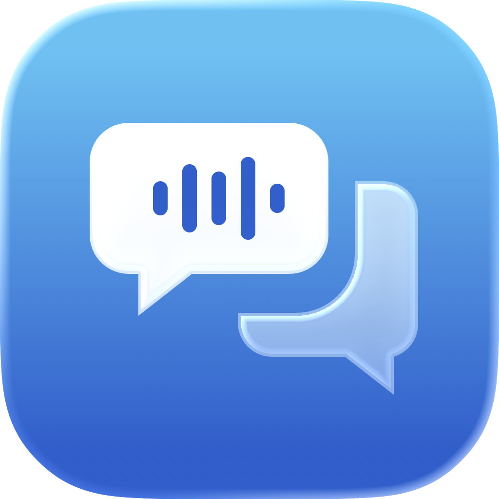
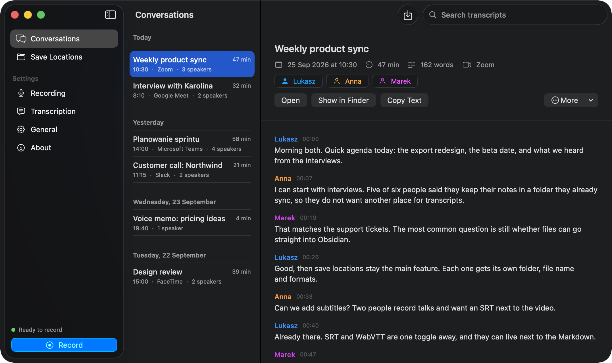

<p align="center">
  
</p>

<h1 align="center">EchoPad</h1>

<p align="center">
  <strong>Every call, on paper.</strong><br>
  EchoPad records your calls and meetings on your Mac, tells the speakers apart<br>
  and saves the transcript where you keep your notes.
</p>

<p align="center">
  <a href="https://echopad.lucaspiera.com"><strong>Documentation</strong></a> ·
  <a href="#install">Install</a> ·
  <a href="https://echopad.lucaspiera.com/docs/privacy">Privacy</a> ·
  <a href="https://github.com/pieralukasz/echopad/issues">Issues</a>
</p>

<p align="center">
  
  
  
  
</p>

<p align="center">
  
</p>

## Why EchoPad

No bot joins the call, nothing is uploaded and there is no subscription. EchoPad records your microphone and the sound of the call as two separate tracks, so it knows which words are yours. It transcribes with [NVIDIA Parakeet TDT v3](https://huggingface.co/nvidia/parakeet-tdt-0.6b-v3), separates the other speakers with on-device diarization, and writes the result to any folder you choose.

- **Works with every call app.** Zoom, Google Meet, Teams, Slack, FaceTime, a browser tab. EchoPad hears the Mac's audio output, not a meeting API.
- **Your folders, your format.** Save locations with a file name template, subfolders, Markdown, plain text, SRT, WebVTT or JSON, with or without the audio. An Obsidian vault is just one of the options.
- **Local.** Speech recognition and diarization run on the Neural Engine through [FluidAudio](https://github.com/FluidInference/FluidAudio). After a one-time download of about 480 MB it works offline.
- **Native.** SwiftUI and Liquid Glass on macOS 26, living in the menu bar.

### The recording pill

A small piece of Liquid Glass shows that EchoPad is listening, with the elapsed time, a live waveform and a stop button. You can also stop from the menu bar or with ⇧⌘E.

<p align="center">
  
</p>

When a call app starts using the microphone, EchoPad can offer to record it with a notification. It never starts on its own.

## Install

Requires macOS 26 and Xcode 26 or its Command Line Tools (Swift 6.2).

```bash
git clone https://github.com/pieralukasz/echopad.git
cd echopad
scripts/install.sh
```

The script builds a release, installs `~/Applications/EchoPad.app` and opens it. The setup window asks for the microphone and system audio permissions, downloads the models and lets you choose where transcripts go.

Coming from EchoPad 1.x (Python)? The installer quits it, turns off its login item and keeps it as `EchoPad 1.x.app`. Your old transcripts stay where they are.

Uninstall with `scripts/uninstall.sh`, or `scripts/uninstall.sh --purge` to also delete settings and the conversation library. Transcripts in your save locations are never touched.

## Packages

EchoPad is built on two Swift packages that you can use in your own apps:

- **[ScribeKit](https://github.com/pieralukasz/ScribeKit)**: Parakeet v3 transcription with speakers, echo removal and exporters for Markdown, text, SRT, WebVTT and JSON.
- **[SystemAudioKit](https://github.com/pieralukasz/SystemAudioKit)**: the microphone and system audio as aligned tracks, through Core Audio process taps with a ScreenCaptureKit fallback, plus call detection.

## Documentation

The full guide is at **[echopad.lucaspiera.com](https://echopad.lucaspiera.com)**: recording, save locations, the file formats, settings, languages, privacy and troubleshooting. Its source lives in [`docs-site`](docs-site), built with [Fumadocs](https://fumadocs.dev):

```bash
cd docs-site && bun install && bun run dev
```

## Development

```bash
swift test
swift build -c release && scripts/bundle-app.sh .build/release/echopad .build/EchoPad.app 2.0.0
open -n --env ECHOPAD_DATA_DIR=/tmp/echopad-dev .build/EchoPad.app   # separate library and settings
```

See the [architecture page](https://echopad.lucaspiera.com/docs/architecture). The Python version (1.x) is kept under the `v1-python` tag.

## License

MIT. See [LICENSE](LICENSE). Speech recognition is NVIDIA Parakeet TDT v3 via FluidAudio (Apache 2.0).
